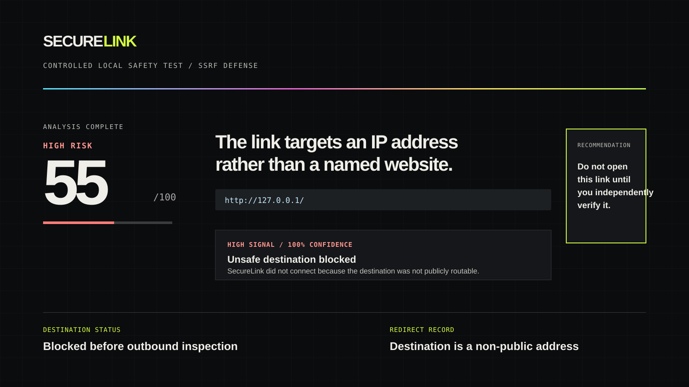
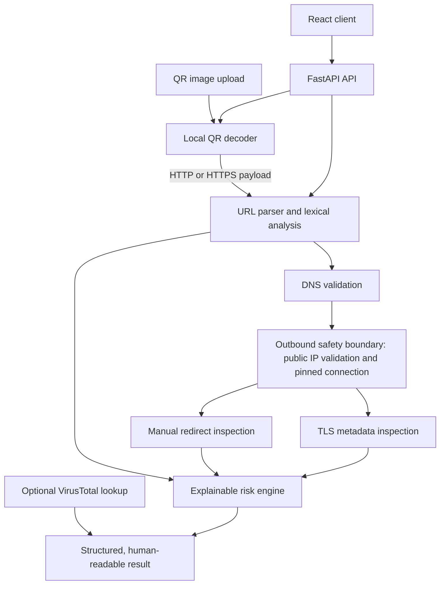

# SecureLink

[](https://github.com/jokepool710/securelink/actions/workflows/ci.yml)
[](LICENSE)
[](https://www.python.org/)
[](https://react.dev/)

SecureLink is a privacy-conscious URL and QR security analyzer that safely inspects suspicious destinations and produces an explainable risk assessment.

> **Launch status:** the codebase is release-ready and its public Vercel deployment is awaiting account sign-in and live verification. A public demo URL will be added here only after those checks pass.



*A sanitized capture based on an executed local SSRF safety test. `127.0.0.1` was classified as high risk and blocked before an outbound request. It is a controlled result, not a claim about an external website.*

## Problem

Phishing links, QR-code destinations, deceptive domains, URL obfuscation, and redirect chains make it difficult to tell where a link leads before opening it. HTTPS protects a connection in transit; it does not establish that the destination is legitimate. Reputation services can add context, but a single safe/unsafe label does not explain what a user should inspect.

SecureLink is an inspection aid. It does not promise that a URL is safe and does not replace endpoint protection or incident response.

## Why this project is useful

SecureLink is designed for people who need to understand a suspicious URL before trusting it—not just receive a binary warning. It brings together URL scanning, phishing-signal explanation, QR-code destination inspection, redirect analysis, DNS/TLS context, homograph detection, and SSRF-aware outbound inspection in one small, documented codebase.

Relevant discovery terms: **cybersecurity, phishing detection, URL scanner, QR security, link analysis, redirect analysis, homograph detection, FastAPI, React, TypeScript, SSRF defense**.

## What SecureLink does



For a URL, SecureLink parses it, evaluates deterministic structural signals, safely inspects DNS/TLS/redirect context, and combines that evidence into a recommendation. Optional VirusTotal data is returned as separate context; it does not change the local risk score. A URL carried in a QR code goes through the same URL-analysis path; non-URL QR payloads are reported without being opened.

## Key security capabilities

- SSRF-resistant outbound analysis with public-address validation and connection pinning.
- Manual redirect traversal with a five-hop limit and validation at every hop.
- URL structural signals for embedded credentials, encoding, long URLs, unusual ports, IP hosts, subdomain depth, and higher-abuse TLD context.
- IDN/Punycode, mixed-script, confusable-character, and curated brand-resemblance analysis.
- DNS-address context and TLS metadata collected over validated connections.
- Optional, explicit VirusTotal URL lookup with controlled provider-failure handling.
- In-memory QR decoding with byte, format, MIME, dimension, and pixel limits.
- Per-IP, in-memory rate limiting and controlled API error responses.
- Simple and technical result views with evidence, severity, confidence, rationale, and inspection metadata.

## Explainable risk scoring

Each evidence item has an identifier, severity, confidence, human-readable explanation, and optional structured details. The current risk engine is deterministic:

| Severity | Base weight |
|---|---:|
| Info | 0 |
| Low | 5 |
| Medium | 14 |
| High | 28 |
| Critical | 45 |

For each item, the contribution is `base weight × confidence`. SecureLink sums contributions, rounds the result, and caps the score at 100. Scores of 15, 40, and 70 begin the medium, high, and critical categories respectively. The result response includes the underlying evidence; the technical view exposes parsed URL, redirect, DNS, and TLS context. No positive signal discounts a dangerous one.

This is an explainable heuristic, not a reputation guarantee. Signals such as an IDN, a non-standard port, or a particular TLD can be legitimate and are described with appropriate uncertainty.

## SSRF defense

Inspecting a submitted URL is itself an outbound-request risk. SecureLink reduces this risk by:

- accepting only absolute `http` and `https` URLs;
- rejecting loopback, private, link-local, multicast, unspecified, carrier/internal, metadata, IPv4-mapped IPv6, and other non-global destinations;
- treating `localhost`, `*.localhost`, and `localhost.` as unsafe;
- resolving both A and AAAA records and rejecting a host when any resolved address is non-public;
- resolving and validating each redirect target again;
- connecting to a previously validated numeric address while retaining the intended HTTP Host header and TLS SNI, which avoids a second uncontrolled DNS resolution at connect time;
- reading only bounded response headers with a short timeout; and
- never executing browser JavaScript, cookies, page content, or submitted credentials.

This is defense in depth, not an absolute claim of SSRF prevention. See the [threat model](docs/THREAT_MODEL.md) and [security tests](docs/SECURITY_TESTING.md) for residual risks and executed regressions.

## Privacy

- URL inspection sends an outbound request to the inspected destination. The request exposes the service network identity and the requested host/path/query needed for inspection.
- Submitted URL credentials are not used for outbound authentication and are redacted from results, redirect displays, and optional provider lookups.
- QR images and analysis results are processed in memory and are not stored by the application.
- VirusTotal is disabled by default. A lookup occurs only when `ENABLE_EXTERNAL_INTEL=true`, a VirusTotal key is configured, and the caller supplies `external_intelligence: true`. The redacted URL sent to the provider can still include its path and query.
- SecureLink has no custom URL or QR-content logging. Hosting, reverse-proxy, and Uvicorn access logs can still retain client addresses and request paths; operators control their retention and redaction.

## API

| Endpoint | Input | Result and controls |
|---|---|---|
| `GET /api/health` | None | Returns `{"status":"ok"}`. Exempt from rate limiting for health checks. |
| `POST /api/analyze/url` | JSON: `url` (required, max 4096 characters), `external_intelligence` (optional strict boolean) | Returns parsed URL, evidence, risk score, recommendation, redirect/DNS/TLS context, and optional intelligence. Limited to 10 requests/minute per client IP. Invalid input returns controlled `422` errors. |
| `POST /api/analyze/qr` | Multipart `file` | Accepts PNG, JPEG, and WebP only; 5 MB and 20-megapixel limits apply before OpenCV decoding. URL payloads use the same URL analyzer. Limited to 6 requests/minute per client IP. Invalid type, content, dimensions, or QR data return controlled `415`, `413`, or `422` errors. |

The default limiter is in-memory and per process. Deployments using multiple workers need shared, edge-level rate limiting.

## Run locally

Prerequisites: Python 3.12, Node.js 22 with Corepack, and pnpm 11.19.0 (declared in `frontend/package.json`).

```powershell
git clone https://github.com/jokepool710/securelink.git
cd securelink
Copy-Item .env.example .env

python -m venv .venv
.\.venv\Scripts\python.exe -m pip install --upgrade pip
.\.venv\Scripts\python.exe -m pip install -r backend\requirements.txt

Push-Location backend
..\.venv\Scripts\python.exe -m uvicorn app.main:app --host 127.0.0.1 --port 8000
```

In a second PowerShell window:

```powershell
cd securelink
corepack enable
Copy-Item frontend\.env.example frontend\.env.local
Set-Location frontend
pnpm install --frozen-lockfile
pnpm run dev
```

Open the Vite URL shown in the second terminal, normally `http://localhost:5173`. `frontend/.env.local` is optional; its default API URL is `http://localhost:8000`.

## Testing

From the repository root:

```powershell
.\.venv\Scripts\python.exe -m compileall -q backend
.\.venv\Scripts\python.exe -m pytest -q

Set-Location frontend
pnpm install --frozen-lockfile
pnpm run build
pnpm audit --prod
```

The backend suite includes SSRF, redirect, DNS-failure, URL-input, credential-redaction, provider-failure, QR, and resource-limit regressions. CI runs the same compile/test/build checks plus dependency audits.

## Docker

Docker deployment is configured through `docker-compose.yml` with non-root API execution, read-only filesystems, dropped capabilities, temporary writable paths, and health checks.

```powershell
docker compose config
docker compose up --build
```

Docker runtime verification on a development machine requires a working Docker engine and, on Windows, hardware virtualization. It was not runnable on the development host used for the security audit because virtualization support was unavailable.

## Deployment

SecureLink is deliberately small: a static React frontend makes HTTPS requests to a single FastAPI API. The API performs the controlled outbound inspection; browsers never receive an SSRF-capable network client or a provider credential.

Before deploying, set ENVIRONMENT=production, configure ALLOWED_ORIGINS to the exact public frontend origin, and set the public build-time VITE_API_BASE to the API's HTTPS URL. VITE_API_BASE is included in the frontend bundle, so it must never be a secret. Keep ENABLE_EXTERNAL_INTEL=false unless VirusTotal sharing is a deliberate product and privacy decision. See [deployment notes](docs/DEPLOYMENT.md) for the full configuration and operational boundary.

## Limitations

- Inspection is not proof that a destination is safe.
- Public destinations and DNS can be unavailable, slow, or deceptive.
- SecureLink intentionally does not execute JavaScript, crawl page content, follow browser-only flows, or submit credentials.
- Threat intelligence is optional and API-key dependent; it does not replace local analysis.
- Rate limiting is in-memory for this single-process MVP.
- Docker container runtime verification remains environment-dependent.

## Roadmap

- CI security scanning and release checks.
- Shared rate limiting for multi-worker deployments.
- Additional threat-intelligence providers, subject to documented privacy and reliability tradeoffs.
- Deployment observability with privacy-aware operational controls.

## Further documentation

- [Threat model](docs/THREAT_MODEL.md)
- [Security testing](docs/SECURITY_TESTING.md)
- [Research and product positioning](docs/RESEARCH.md)
- [Interview notes](docs/INTERVIEW_NOTES.md)
- [Deployment notes](docs/DEPLOYMENT.md)
- [Security disclosure policy](SECURITY.md)

## License

SecureLink is available under the [MIT License](LICENSE).
